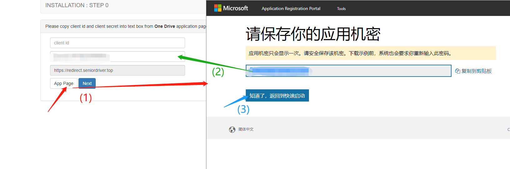
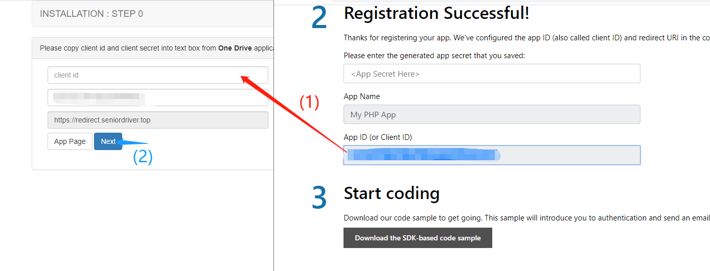
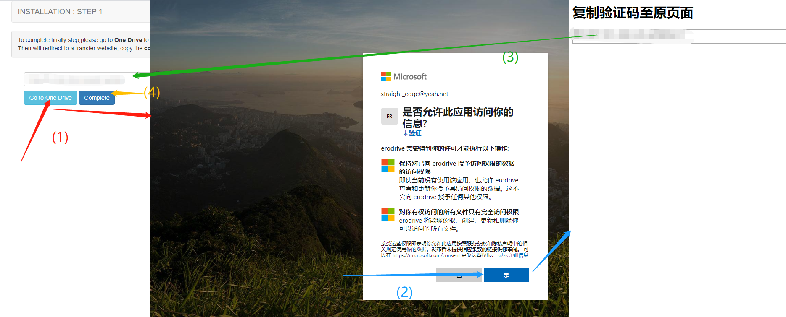
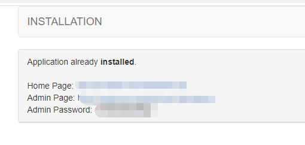

# ERO DRIVE
一个用Django写的One Drive网盘，参考项目[oneindex](https://github.com/donwa/oneindex)  

   
 ## 前言
 这个项目一开始是因为我之前接触过oneindex，然后刚好也在学Python，在想要不试下自己拿Python模仿oneindex写一个项目练练手。  
 在基础功能都写好后发现其实已经有一个[PyOne](https://github.com/abbeyokgo/PyOne)的项目，而且功能还挺多的。  
 不过我也只是拿来练手无所谓。  
   
在写这个项目的过程中其实也学到了不少Python知识，我会把部分问题总结好并更新到我的博客 [Rob's blog](https://roblog.top)

## 部署
要求:  
> Python版本 >= 3.7  
  
Nginx配置:
```server {
    listen          80;
    server_name     disk.forexample.com;
    index           index.html index.php;

    location /{
        proxy_redirect off;
        proxy_pass http://127.0.0.1:8000;
    }
}
```

运行项目:  
确保在erodrive/erodrive目录  
`python manage.py runserver 0.0.0.0::8000`  
端口自己修改，可以后面带上nohup等命令，这里我推荐[supervisor](http://www.supervisord.org/)
  
定时任务:  
`*/30 * * * * python /project_path/erodrive/erodrive/manage.py RefreshToken`  
每30分钟执行一次刷新token的命令，路径啥的根据自己服务器的来

## 安装
  
项目成功运行后，进入后会要你先到One Drive那边拿client secret和client id,
并将client secret和client id填到文本框内。  
  
 
切记页面先出现的是client secret，后面才是client id!  
填好就下一步。  

  
这里也是先要你去One Drive那边允许访问，允许后会带上一个code参数跳转到一个中转网页。  
你只需要将中转页里面显示的值复制粘贴到文本框，然后点完成即可。  

  
安装成功会显示这个页面。

## 命令
除了上面提到的RefreshToken之外，还有上传。方便你将服务器内的文件上传到网盘。  
#### 上传文件
`python manage.py Upload file local_file remote_path`  
local_file替换为你本地的文件的路径，如 /usr/file/hello_world.php  
remote_path替换为你想上传到One Drive的目录 如 /upload
#### 上传目录
`python manage.py Upload folder local_folder remote_path`  
local_folder替换为你本地的文件的路径，如 /usr/file  
remote_path替换为你想上传到One Drive的目录 如 /upload
## TODO LIST 
*  ~~使用上传命令时优化信息提示~~ (已完成)
*  ~~上传目录命令使用asyncio~~ (已完成)
*  上传目录命令使用asyncio + aiohttp
*  使用Redis缓存
*  后台增加上传端口、session过期时间、缓存过期时间等等....